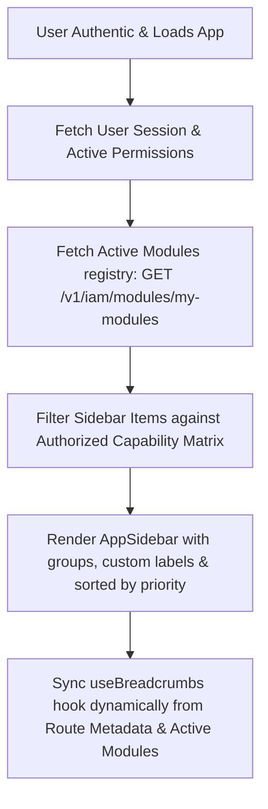

# Sentry IAM: Dynamic Sidebar & Breadcrumb Navigation Architecture Plan

This document outlines the architectural plan for restructuring the Admin CMS sidebar navigation, routing guards, and breadcrumbs to dynamically adjust based on Identity and Access Management (IAM) capabilities and active user policies.

---

## 1. Core Architecture Overview

To support granular access control, the sidebar navigation and routes must transition from **static hardcoded configs** to **dynamic state-driven feeds**.



---

## 2. Refined Navigation Hierarchy & Grouping

We categorize the application modules into five explicit, logical groups. Each group maps to a distinct system tier to prevent clutter and ensure auditors, admins, and regular employees only see relevant tools.

### Grouping and Ordering Schema

| Group Name               | Label             | Icon / Concept             | Module Path              | Default Priority | Access Scope                               |
| :----------------------- | :---------------- | :------------------------- | :----------------------- | :--------------- | :----------------------------------------- |
| **Workspace**            | Home              | `Home03Icon`               | `/`                      | 1                | All Authenticated Users                    |
|                          | Overview          | `DashboardSquare01Icon`    | `/dashboard`             | 2                | All Authenticated Users                    |
|                          | Inbox             | `InboxIcon`                | `/inbox`                 | 3                | All Authenticated Users                    |
|                          | Updates           | `BellPlusIcon`             | `/updates`               | 4                | All Authenticated Users                    |
| **Identity & Access**    | Users Directory   | `Users` (Custom or Shield) | `/iam/users`             | 10               | Super Admin, IAM Admin, Department Manager |
|                          | Roles Registry    | `Roles`                    | `/iam/roles`             | 20               | Super Admin, IAM Admin, Auditor (Read)     |
|                          | Policies Registry | `Policies`                 | `/iam/policies`          | 30               | Super Admin, IAM Admin, Auditor (Read)     |
|                          | Module Registry   | `Modules`                  | `/iam/modules`           | 40               | Super Admin, IAM Admin                     |
| **Governance & Tools**   | Access Matrix     | `GridIcon`                 | `/iam/access-matrix`     | 50               | Super Admin, IAM Admin, Auditor            |
|                          | Policy Simulator  | `CpuIcon`                  | `/iam/access/simulate`   | 60               | Super Admin, IAM Admin, Auditor            |
| **Security & System**    | Active Sessions   | `LaptopPhoneSyncIcon`      | `/iam/sessions`          | 70               | Super Admin, IAM Admin, Users (Self Only)  |
|                          | Security Settings | `ShieldKeyIcon`            | `/iam/security/settings` | 80               | Super Admin, IAM Admin                     |
|                          | Audit Logs        | `Audit02Icon`              | `/iam/audit/logs`        | 90               | Super Admin, IAM Admin, Auditor            |
|                          | Activity Log      | `Audit02Icon`              | `/iam/audit/me`          | 100              | All Authenticated Users                    |
| **Utilities** _(Bottom)_ | Settings          | `Settings01Icon`           | `/settings`              | 998              | All Authenticated Users                    |
|                          | Support & Help    | `Quiz05Icon`               | `/support`               | 999              | All Authenticated Users                    |
|                          | Feedback          | `SentIcon`                 | `/feedback`              | 1000             | All Authenticated Users                    |

---

## 3. Dynamic Sidebar Rendering Engine

### A. The Module Interface

We represent every navigation item using the `IModule` data interface:

```typescript
export interface INavItem {
  id: string;
  title: string;
  url: string;
  icon?: string; // Icon key parsed dynamically (e.g. "Shield01Icon")
  priority: number;
  category:
    "core" | "system" | "feature" | "integration" | "governance" | "utility";
  isActive?: boolean;
  badge?: string;
  items?: Omit<INavItem, "icon">[]; // Sub-menu items
}
```

### B. Access filtering process

The client-side sidebar should compile using a custom hook: `useSidebarMenu()`.

1. **Fetch permissions**: Obtain the user's active session permissions from Redux/React Query.
2. **Fetch active modules**: Obtain the `modules` tree from the API database (`/v1/iam/modules/my-modules`).
3. **Evaluate against Policy Engine**: Filter out items where the user does not have `read` / `view` capability for that resource path.
4. **Sort and Partition**:
   - Order primary links and child menus dynamically by `priority`.
   - Distribute items into: `navMain`, `navPrimary`, `navGovernance`, `navSystem`, and `navSecondary` hooks.

---

## 4. Dynamic Breadcrumbs Resolution

The current `use-breadcrumbs.ts` hook contains a static, hardcoded dictionary. If a dynamic module is registered or an access permission changes, the breadcrumb component breaks or displays stale data.

### Proposed Dynamic Breadcrumb Generator

Instead of static maps, we will use a **dynamic path segment parser** that references `routes.config.tsx` and active runtime configurations:

```typescript
import { matchPath, useLocation } from "react-router-dom";

import { IRouteConfig, routes } from "@/routes/routes.config";

export function useBreadcrumbs() {
  const { pathname } = useLocation();
  const items = [{ title: "Home", href: "/" }];

  // 1. Split the pathname into segments
  const segments = pathname.split("/").filter(Boolean);

  // 2. Iterate and match route config to resolve accurate labels
  let accumulatedPath = "";
  segments.forEach((segment) => {
    accumulatedPath += `/${segment}`;

    // Find matching route config, handling dynamic parameters like :id
    const matchedRoute = findMatchingRoute(accumulatedPath, routes);

    if (matchedRoute) {
      items.push({
        title: matchedRoute.title || formatSegment(segment),
        href: matchedRoute.path ? `/${matchedRoute.path}` : undefined,
      });
    }
  });

  return items;
}
```

### Dynamic Parameters Interpolation

For dynamic detail pages (e.g., `/iam/users/:id`), the breadcrumb can inspect the active detail state (like the current user record's name) to display `Home > Users > Jane Doe` instead of `Home > Users > User Details (42)`.

---

## 5. Instant Access Updates & Reflection

A key requirement is that when a manager grants or revokes access to core or dynamic modules, the UI must reflect this immediately without requiring a full page refresh.

### The Refresh Mechanism

1. **Permissions Eviction Trigger**:
   Upon modification of a User's roles or direct policies, or a Module's status:
   - Invalidate the Query Cache: `queryClient.invalidateQueries(["user-modules", "user-permissions"])`.
2. **Re-evaluating Guards**:
   - If the user is currently viewing a page they no longer have access to, the `RouteGuard` triggers and redirects them immediately to a `403 Forbidden` screen or the dashboard overview.
3. **Redrawing Navigation**:
   - The reactive state update triggers `AppSidebar` to redraw immediately. The menu link fades out or disappears smoothly.

---

## 6. Implementation Action Plan

### Step 1: Update the Module Store & Mock APIs

- Implement mocks or REST endpoints in `src/api/iam/modules.ts` to return modules structured according to user profiles.
- Set up React Query bindings for `/v1/iam/modules/my-modules`.

### Step 2: Implement Dynamic Menu Compiler

- Refactor `src/layout/app-sidebar.tsx` to read navigation items from the react-query hook rather than local mock variables.
- Write icon resolver helpers that dynamically map string identifiers (like `"Shield01Icon"`) to Hugeicon components.

### Step 3: Upgrade Breadcrumbs Resolution

- Refactor `src/hooks/use-breadcrumbs.ts` to implement the dynamic segment matching matching algorithm.
- Link the detail page contexts (e.g., selected user or role state) so breadcrumbs dynamically render the user's name or role's title.

### Step 4: Secure RouteGuard

- Extend `src/routes/route-guard.tsx` to evaluate permissions against the loaded capabilities list.
